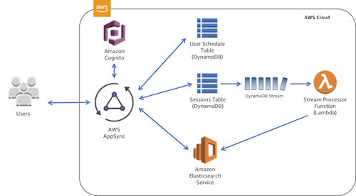
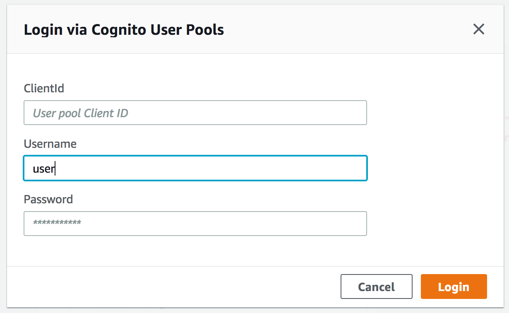

# AWS AppSync Session Manager

aws-appsync-session-manager is a sample project that explores [AWS AppSync](https://aws.amazon.com/appsync/) to build the backend of a scheduling app for a technology conference. The app allows editors to create sessions and users to register for those sessions.

The goals of this project are to:

1. Exercise AppSync's integration with all currently supported data sources: [Amazon DynamoDB](https://aws.amazon.com/dynamodb/), [Amazon Elasticsearch Service](https://aws.amazon.com/elasticsearch-service/), and [AWS Lambda](https://aws.amazon.com/lambda/).
2. Build all AWS resources via [AWS CloudFormation](https://aws.amazon.com/cloudformation/).
3. Leverage AWS AppSync integration with [Amazon Cognito](https://aws.amazon.com/cognito/) to secure resources and scope mutations to appropriate roles.

## Getting Started

To get started, clone this repository:

```
$ git clone https://github.com/jkahn117/aws-appsync-session-manager.git
```

### Prerequisites

This project requires the following to get started:

* Select an AWS Region into which you will deploy services. Be sure that all required services (AWS AppSync in particular) are available in the Region you select.
* Confirm your [installation of the latest AWS CLI](http://docs.aws.amazon.com/cli/latest/userguide/installing.html).
* Confirm the [AWS CLI is properly configured](http://docs.aws.amazon.com/cli/latest/userguide/cli-chap-getting-started.html#cli-quick-configuration) with credentials that have administrator access to your AWS account.
* [Install jq](https://stedolan.github.io/jq/download/).

## Create AWS Resources

We will use AWS CloudFormation (with the AWS Serverless Application Model) to package and deploy our AWS resources. These include AWS AppSync data sources, resolvers, and schema as well as the underlying resources. The high-level architecture is as follows:



To simplify deployment, the project includes a [Makefile](./Makefile) that wraps deployment and helper commands.

First, open the Makefile in your favorite text editor and modify the first few lines (note: we will create an Amazon S3 bucket shortly, just choose a name here):

``` bash
MY_EMAIL ?= me@example.com

AWS_BUCKET_NAME ?= MYNAME-appsync-session-manager
# modify if you want stack name to be different than bucket name
AWS_STACK_NAME ?= $(AWS_BUCKET_NAME)
AWS_REGION ?= us-east-2
```

Next, we'll deploy the project to our AWS environment. *Please note that this can take up to 30 minutes.*

``` bash
# create new Amazon S3 bucket
$ make create-bucket

# install NPM modules and create template.yaml for your project
$ make setup

# deploy project (again, this can take 30 minutes)
$ make deploy
```

While you wait for the resources to be created, note that the `deploy` target includes two helpful tasks:

1. `package` - packages template and uploads code to S3 bucket
2. `upload-schema` - uploads GraphQL schema ([schema.graphql](./schema.graphql)) to S3 bucket

Once resource creation is complete, the Makefile includes two tasks that you can use to review the resources created by CloudFormation:

1. `describe` - description of CloudFormation stack
2. `outputs` - resource information required for future reference (e.g. Cognito User Pool ID)

## Creating Test Users & Loading Sample Data

To exercise the functionality, we will create two sample users in the Cognito User Pool, an editor and a user. Both users have a default password of 'NewPassword1%'.

``` bash
# create the user
$ make create-user

# create an editor (has permissions to create, edit, remove sessions)
$ make create-editor
```

To finish set-up, we can load our session catalog with sample data:

``` bash
# push sample data (from 2017 AWS re:Invent) to our session catalog
$ make load-session-data
```

## Testing the Backend

AWS AppSync provides a built-in GraphQL query tool in the AWS Console that we will use to exercise our API:

1. Launch the AWS Console in your favorite browser
2. Navigate to AWS AppSync and select the "Session Manager" API
3. In the left-hand menu, select "Queries"

Our API requires an authenticated user to access the API. Click on the "Login with User Pools" button:



Enter the following:

* *ClientId* - retrieve via `make outputs`, use the OutputValue of 'CognitoClientId' (a alphanumeric string)
* *Username* - 'user'
* *Password* - 'NewPassword1%'

Having signed in as a user, we can now exercise a few queries by pasting the following in to query editor on the left:

``` graphql
query AllSessions {
  allSessions {
    sessions {
      Title
      StartTime
    }
  }
}
```

Click the orange 'Run' button to execute the query. You can also return more information by including additional fields in the GraphQL query.

The `allSessions` query is resolved via a query to a DynamoDB table. You can view the resolver in the CloudFormation template or in the AWS Console.

Next, we can search for a session related to Amazon VPC using the `search` query, which resolves to Elasticsearch. Note that we use a DynamoDB Stream to load the Elasticsearch index as records are inserted into the table.

```graphql
query Search {
  search(text: "vpc") {
    sessions {
      SessionId
      Title
      Description
    }
  }
}
```

Again, copy and paste the above query in the query editor and click Run to view results. For more detail on the query execution, click on the "Logs" checkbox to store logs in Amazon CloudWatch.

Next, copy the SessionId from the results of the previous query and modify the following before executing a GraphQL mutation to add the session to the current user's schedule:

```graphql
mutation ScheduleSession {
  scheduleSession(SessionId: "SESSION_ID") {
    Sessions {
      Title
      StartTime
      EndTime
    }
  }
}
```

The result of the mutation will be the user's schedule; however, we can also query for the currently logged in user's schedule via the following query:

```graphql
query UserSchedule {
  userSchedule {
    User {
      Username
      Email
    }
    Sessions {
      Title
    }
  }
}
```

Note that the query does not include a user identifier, instead AppSync will retrieve the user's unique [Cognito identifier from the query context](https://docs.aws.amazon.com/appsync/latest/devguide/resolver-context-reference.html).

Before we schedule a new session, let's verify that the user cannot perform an editor action, removing a session from the catalog.

```graphql
mutation RemoveSession {
  deleteSession(SessionId: "SESSION_ID") {
    SessionId
  }
}
```

In the result pane, you should now see an error result with the messsage "Not Authorized to access deleteSession on type Mutation."

### Editor

Next, let's exercise the editor-only functionality of the API. Start, by clicking the "Logout" button and entering the following:

* *ClientId* - retrieve via `make outputs`, use the OutputValue of 'CognitoClientId' (a alphanumeric string)
* *Username* - 'editor'
* *Password* - 'NewPassword1%'

Editors are able to create new sessions via the `createSession` mutation:

```graphql
mutation CreateSession {
  createSession(
    Session: {
      Title: "My GraphQL Session",
    	StartTime: "2018-06-13 15:00:00-0500",
    	EndTime: "2018-06-13 15:45:00-0500",
    	Description: "A new session created via AWS AppSync",
    	SessionType: Breakout
    }
  ) {
    SessionId
    Title
  }
}
```

Let's verify both that the session was created in the DynamoDB sessions table and that the data was pushed to Elasticsearch by calling the `search` query again:

```graphql
query Search {
  search(text: "graphql") {
    sessions {
      SessionId
      Title
      StartTime
    }
  }
}
```

You should see a result similar to this:

```json
{
  "data": {
    "search": {
      "sessions": [
        {
          "SessionId": "60c7a3f8-57b4-4bb1-8a89-d1c678ecf67b",
          "Title": "My GraphQL Session"
        }
      ]
    }
  }
}
```

Grab the `SessionId` value from the result. We will now delete the session using the `deleteSessions` mutation:

```graphql
mutation DeleteSession {
  deleteSession(SessionId: "SESSION_ID") {
    SessionId
  }
}
```

## Cleaning Up

To clean-up all resources associated with this project (i.e. delete all resources), enter the following:

```bash
$ make cleanup
```

## Managing schema.graphql

In this project, you might notice that our GraphQL schema is managed in [schema.graphql](./schema.graphql) that is uploaded to your S3 bucket as part of the `deploy` (or `upload-schema`) task. AWS CloudFormation provides the option to define your schema inline (see `Definition` attribute [here](https://docs.aws.amazon.com/AWSCloudFormation/latest/UserGuide/aws-resource-appsync-graphqlschema.html#cfn-appsync-graphqlschema-definition)); however, this approach [does not play well](https://github.com/awslabs/serverless-application-model/issues/461) with SAM. In the end, externalizing the schema made it clear where / how the schema is defined.

## Further work

* Build frontend UI
* Track seat counts for sessions, only allow user to register if space exists
* When editor deletes a session, remove from user schedules / notify?
* Demonstrate how to subscribe to session updates
* Allow editors to only alert users to particular sessions being created
* Support pagination in search query

## Authors

* **Josh Kahn** - *Initial work*
